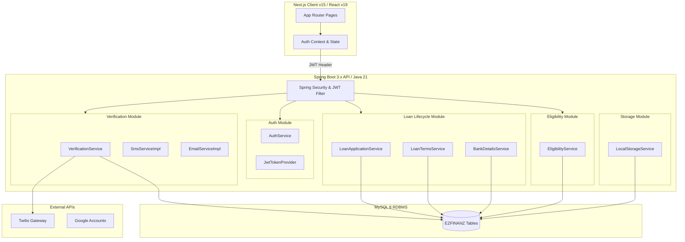
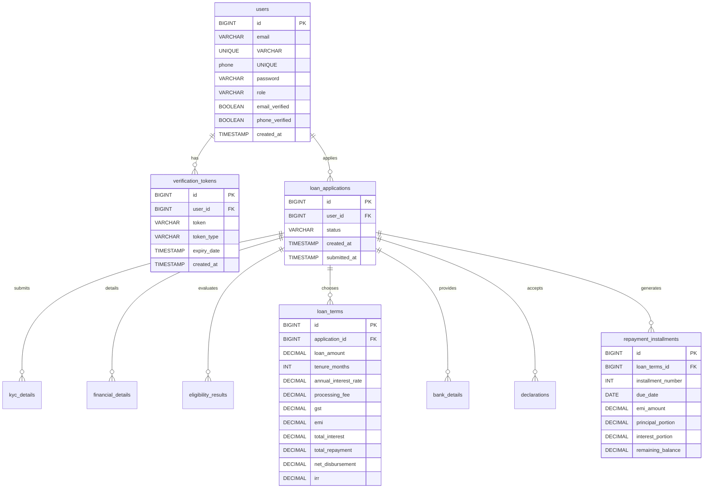

# EZFINANZ Personal Loan System - Engineering & Implementation Workflow

**GitHub Repository**: [https://github.com/lakshman-1289/Personal-Loan-System](https://github.com/lakshman-1289/Personal-Loan-System)

---

## 1. Architectural Architecture & Design Patterns

The **EZFINANZ Personal Loan System** is designed from the ground up as a **Modular Monolith**. This architectural choice ensures high cohesion within functional modules while minimizing operational complexity during early-stage development, with a clean path to migrate to independent microservices when required.



### Core Architecture Principles:
1.  **Strict Modular Boundaries**: Business areas (Auth, Verification, KYC, Eligibility, Loan, Calculation) are separated by Java packages. Circular dependencies are avoided, and modules communicate via clear service interfaces.
2.  **Stateless Security**: Spring Security is configured to use token-based authentication using **JSON Web Tokens (JWT)**. Sessions are not persisted on the server (`SessionCreationPolicy.STATELESS`), allowing the backend to scale horizontally.
3.  **Interface Segregation**: Integrations (such as sending emails, SMS, or validating identity details) are abstracted behind Java interfaces. This allows switching between mock implementation classes (for local testing) and real providers (like Twilio SMS) using Spring profiles.

---

## 2. Database Schema & Relational Design

The database schema is mapped in **MySQL 8.x** via Hibernate/JPA. Primary keys are configured with auto-increment behavior, and index keys are created on foreign keys to optimize query performance.



### Strategic Mapping Rules Applied:
*   **Enum Representation**: Column mappings for states and types (such as `ApplicationStatus`, `VerificationTokenType`, `Role`, `Gender`, and `AccountType`) are declared with `@Enumerated(EnumType.STRING)`. This ensures they are saved as readable strings in MySQL, preventing database corruption if enum orders are modified in the source code.
*   **Temporal Precision**: Standard dates (like Date of Birth) are mapped with `@Column(name = "date_of_birth", columnDefinition = "DATE")`. Audit parameters use `@CreationTimestamp` and `@UpdateTimestamp` to maintain accurate write history automatically.
*   **Currency Representation**: All monetary columns utilize the Java `BigDecimal` type and map to MySQL `DECIMAL(18, 2)` to eliminate floating-point arithmetic errors.

---

## 3. Module-by-Module Engineering Implementation

### A. Authentication Module (`com.ezfinanz.auth`)
Provides login, registration, and user session management.
*   **JWT Token Lifecycle**: Upon successful login, [JwtTokenProvider.java](file:///c:/Users/Nithinkumar/Desktop/Lakshman%20Desktop/Personal-Loan-System/backend/src/main/java/com/ezfinanz/auth/util/JwtTokenProvider.java) encodes the user's ID, email, and security role into a JWT signed with a Base64-encoded secret key using the HMAC-SHA256 signature algorithm.
*   **Security Filter**: The [JwtAuthenticationFilter.java](file:///c:/Users/Nithinkumar/Desktop/Lakshman%20Desktop/Personal-Loan-System/backend/src/main/java/com/ezfinanz/auth/config/JwtAuthenticationFilter.java) runs on every request. It extracts the token from the `Authorization: Bearer <token>` HTTP header, validates its expiration and signature, and populates the `SecurityContextHolder` with standard Spring User Principal credentials.
*   **Google OAuth2 Integration**: Added `spring-boot-starter-oauth2-client` configurations to allow passwordless single sign-on:
    *   *Credential Safety*: Programmed `DotEnvEnvironmentPostProcessor.java` to read client IDs and secrets from local gitignored `.env` variables at runtime.
    *   *OAuth Success Handler*: Created `OAuth2AuthenticationSuccessHandler.java`. Upon successful sign-in, it registers Google users dynamically as `CUSTOMER` with verified email flags, assigns a unique dummy phone number (to satisfy unique db schemas), generates a secure random password, and forwards a valid JWT token back to the frontend.
*   **Database Seeding**: The [AdminUserInitializer.java](file:///c:/Users/Nithinkumar/Desktop/Lakshman%20Desktop/Personal-Loan-System/backend/src/main/java/com/ezfinanz/auth/config/AdminUserInitializer.java) implements `CommandLineRunner`. During startup, it checks the database for an admin role. If not present, it hashes a seed password via `BCryptPasswordEncoder` and inserts the default admin account:
    *   **Admin Email**: `admin@ezfinanz.com`
    *   **Admin Password**: `Admin@123`

### B. Contact Verification Module (`com.ezfinanz.verification`)
Secures phone and email channels using One-Time Passwords (OTPs).
*   **OTP Generation**: The system generates secure, 6-digit random codes:
    ```java
    String otp = String.format("%06d", new Random().nextInt(999999));
    ```
    Tokens are stored in the database with a 10-minute expiry date (`expiryDate = LocalDateTime.now().plusMinutes(10)`).
*   **Real SMTP Email Service**: Added `spring-boot-starter-mail` and `spring-boot-starter-thymeleaf` dependencies. [EmailServiceImpl.java](file:///c:/Users/Nithinkumar/Desktop/Lakshman%20Desktop/Personal-Loan-System/backend/src/main/java/com/ezfinanz/verification/service/EmailServiceImpl.java) uses `JavaMailSender` and Thymeleaf's `TemplateEngine` to bind recipient data to `otp-email.html` template. It also prints the code directly to the server console log for ease of testing.
*   **Twilio SMS Gateway**: Integrates with the **Twilio SMS API**. The service [SmsServiceImpl.java](file:///c:/Users/Nithinkumar/Desktop/Lakshman%20Desktop/Personal-Loan-System/backend/src/main/java/com/ezfinanz/verification/service/SmsServiceImpl.java) instantiates a Twilio client and dispatches the OTP payload asynchronously:
    ```java
    Message.creator(
        new PhoneNumber(toPhone),
        new PhoneNumber(twilioFromNumber),
        "Your EZFINANZ OTP code is: " + otp
    ).create();
    ```
    *Trial Sandbox Fallback*: Catches Twilio exceptions (e.g. when sending to unverified trial numbers) and prints the code directly to the console so that local development remains unblocked.
*   **Token Verification**: Upon submission, the service fetches the latest unused token. If the code matches and is not expired, the user account flags (`emailVerified` / `phoneVerified`) are set to true. The validated token is deleted from the database to prevent reuse.

### C. Loan Lifecycle State Machine (`com.ezfinanz.loan`)
Automates status transitions on the application resource.
*   **Initialization & Dashboard Lifecycle**:
    *   Previously, visiting the dashboard automatically generated a new application on load, overwriting completed/disbursed histories.
    *   *Resolution*: Created a read-only endpoint `GET /api/v1/applications/latest`. The customer dashboard queries this to fetch the actual status.
    *   *Empty State*: If no application exists, a welcome card is displayed with an explicit "Apply for a Personal Loan" button.
    *   *Re-Apply*: If the current status is terminal (`DISBURSED` or `REJECTED`), a status card is rendered with an option to "Apply for another Loan" which executes the `POST` request to start a new application step.
*   **State Machine Transitions**:
    ```text
    [DRAFT / Created]
           │
           ▼
    [EMAIL_VERIFICATION] ──(Verify Email OTP)──► [PHONE_VERIFICATION]
                                                        │
                                                 (Verify Phone OTP)
                                                        │
                                                        ▼
    [KYC_PENDING] ◄─────────────────────────────────────┘
    ```
    Verification services automatically update the application status as verification succeeds. For instance, verifying the email OTP advances the application status to `PHONE_VERIFICATION` and automatically fires the phone verification code.

### D. KYC & Underwriting Modules (`com.ezfinanz.kyc` & `com.ezfinanz.eligibility`)
Verifies user identities and evaluates financial risk.
*   **KYC Logging**: Stores official details (PAN, Address, Date of Birth, and Gender) in the `KycDetails` table. It utilizes a `StorageService` interface to upload verification files (like PDF copies of ID cards) to local directories.
*   **Eligibility Engine**: Implements the debt-to-income (DTI) check.
    $$\text{DTI} = \left( \frac{\text{Existing Monthly Debt Payments}}{\text{Gross Monthly Income}} \right) \times 100$$
    *Underwriting Criteria*:
    *   If Credit Score $\ge 750$ and DTI $\le 40\%$, the application status is set to `ELIGIBLE`.
    *   If Credit Score is between $650$ and $749$ and DTI $\le 45\%$, it is set to `PARTIALLY_ELIGIBLE` with a capped limit.
    *   If it falls below these parameters, the status is set to `NOT_ELIGIBLE` and the application is rejected.

### E. Financial Calculations Module
Implements amortization calculation rules.
*   **Equated Monthly Installment (EMI)**: Evaluates monthly repayments using the formula:
    $$\text{EMI} = P \times \frac{r(1+r)^n}{(1+r)^n - 1}$$
    where $P$ is the principal, $r$ is the monthly interest rate (annual interest rate / 12), and $n$ is the tenure in months.
*   **Amortization Schedule Generation**: Iterates through the loan tenure to generate an array of `RepaymentInstallment` values.
    *   **Monthly Interest Portion**: $\text{Balance} \times r$
    *   **Monthly Principal Portion**: $\text{EMI} - \text{Interest Portion}$
    *   **Remaining Balance**: $\text{Balance} - \text{Principal Portion}$
    Calculations use `BigDecimal` scale formatting (`setScale(2, RoundingMode.HALF_EVEN)`) to ensure exact monetary divisions.
*   **Internal Rate of Return (IRR)**: Computes the true yield percentage of the loan considering upfront administrative fees.

---

## 4. Frontend Architecture & Routing (Next.js 15)

The frontend is built with **Next.js 15** and **React 19** using the App Router structure, styled with **Tailwind CSS v4**.

### Key Frontend Components:
1.  **State Management (`AuthContext.tsx`)**: Stores JWT authentication parameters in browser memory and local storage. It sets up an Axios request interceptor to automatically inject the bearer token into all API calls:
    ```typescript
    axios.interceptors.request.use((config) => {
      const token = localStorage.getItem('token');
      if (token) {
        config.headers.Authorization = `Bearer ${token}`;
      }
      return config;
    });
    ```
2.  **Google OAuth Redirection Success Handler**: Handles callback token processing at [`/login/oauth2/success/page.tsx`](file:///c:/Users/Nithinkumar/Desktop/Lakshman%20Desktop/Personal-Loan-System/frontend/src/app/login/oauth2/success/page.tsx). It decodes the JWT claims in browser memory, updates context states, and handles security redirects.
3.  **Real-Time Admin Dashboard**:
    *   Consolidated system state codes in a simplified 5-category dropdown filter.
    *   Added a real-time keyword search input matching applicant ID, name, or email instantly on the client side.
    *   Modified the API fetch call to load all active queue entries on mount (`size=1000`) and handle query updates in-memory to prevent table redraw lag.
4.  **Onboarding Wizard Layout**: Uses a multi-step form wizard to guide the customer through the loan journey:
    *   `app/register/page.tsx` & `app/login/page.tsx`
    *   `app/verify/email/page.tsx` & `app/verify/phone/page.tsx`
    *   `app/apply/kyc/page.tsx`
    *   `app/apply/financials/page.tsx`
    *   `app/apply/eligibility/page.tsx`
    *   `app/apply/terms/page.tsx`
    *   `app/apply/bank/page.tsx`
    *   `app/apply/declarations/page.tsx`
    *   `app/apply/selfie/page.tsx`

---

## 5. Engineering Challenges & Resolutions

### Challenge 1: Lombok Compile Failure (Command Line vs IDE)
*   **Description**: Running tests from the terminal (`mvnw test`) failed with compilation errors stating that getters, setters, and builders were undefined. However, the project compiled and ran inside the IDE without issue.
*   **Resolution**: The IDE was using annotation processors dynamically, but it saved class files inside the shared `target/` directory without generating Lombok code. When Maven ran, it saw these class files as up-to-date and skipped recompilation. Running `.\mvnw.cmd clean test` deleted this target cache, forcing a clean compile that processed the Lombok annotations.

### Challenge 2: Next.js Port CORS Access Policy
*   **Description**: API calls from the client application running on `http://localhost:3000` to the server at `http://localhost:8080` were blocked by browser CORS policy, and the client could not read the `Authorization` header.
*   **Resolution**: Updated [SecurityConfig.java](file:///c:/Users/Nithinkumar/Desktop/Lakshman%20Desktop/Personal-Loan-System/backend/src/main/java/com/ezfinanz/auth/config/SecurityConfig.java) and implemented a custom `WebConfig` class to allow port 3000, specify allowed headers, and explicitly expose the `Authorization` header to the client:
    ```java
    configuration.setExposedHeaders(Arrays.asList("Authorization"));
    ```

### Challenge 3: MySQL Enum Index Synchronization Issues
*   **Description**: Modifying enum values in code caused database mismatch errors because JPA maps enums to integer indexes by default.
*   **Resolution**: Added the `@Enumerated(EnumType.STRING)` annotation to all entity enum fields. This stores enums as strings (e.g., `APPROVED` or `REJECTED`) in MySQL, making database schema updates safe.

### Challenge 4: React Infinite Render Loop in Auth Context
*   **Description**: Navigating to OAuth callback handlers triggered a `Maximum update depth exceeded` crash.
*   **Resolution**: The context login method references were recreated on every render of `AuthProvider`. Wrapped the `login()` and `logout()` context methods in `useCallback` hooks and added active session presence checks inside page redirect effects to stabilize references.

### Challenge 5: Twilio Trial Account Sandbox Limitations
*   **Description**: Triggering OTPs to unverified destination phone numbers threw an uncaught `ApiException` from Twilio's client SDK, crashing backend controller processes.
*   **Resolution**: Intercepted exceptions inside `SmsServiceImpl.java` using a try-catch fallback. If Twilio blocks the SMS, the backend prints a warning and logs the OTP directly to stdout/console. This prevents server crashes and lets developer testing continue uninterrupted.

### Challenge 6: Next.js Dev Server HMR Webpack Cache Corruption
*   **Description**: Modifying pages or styles while the development server was active led to module chunk mismatches throwing `Cannot read properties of undefined (reading 'call')`.
*   **Resolution**: Terminated the running dev tasks and deleted the `.next` compilation cache folder, forcing a clean webpack chunk rebuild on start.

### Challenge 7: Customer Dashboard Application Overwrites
*   **Description**: Visiting the dashboard automatically triggered a `POST` request to start a new loan application. For users with active or terminal state applications (disbursed or rejected), this broke their status pages and forced them back into `KYC_PENDING` steps.
*   **Resolution**: Swapped the automatic creation for a `GET /api/v1/applications/latest` check. The user dashboard now displays their actual active or terminal application status, and only executes a new application creation when they click the **"Apply for another Loan"** CTA.

---

## 6. How to Build & Run the System

### Step 1: Initialize Database
Start MySQL on port `3306` and create the schema:
```sql
CREATE DATABASE ezfinanz;
```

### Step 2: Configure Environment
Create a `.env` file at the root of the project to secure credentials:
```env
GOOGLE_CLIENT_ID=your_google_client_id
GOOGLE_CLIENT_SECRET=your_google_client_secret
SMTP_USERNAME=ezfinanzloanservice@gmail.com
SMTP_PASSWORD=your_gmail_app_password
TWILIO_ACCOUNT_SID=your_twilio_sid
TWILIO_API_KEY=your_twilio_api_key
TWILIO_API_SECRET=your_twilio_api_secret
TWILIO_FROM_NUMBER=your_twilio_number
```

### Step 3: Boot Backend App
Open a terminal in the `backend/` folder and run:
```powershell
.\mvnw.cmd clean spring-boot:run
```
The server will start on port `8080` and seed the default admin account:
*   **Admin Email**: `admin@ezfinanz.com`
*   **Admin Password**: `Admin@123`

### Step 4: Run Frontend
Open a terminal in the `frontend/` folder and run:
```powershell
npm install
npm run dev
```
Navigate to **`http://localhost:3000`** in your browser. You can register a new user, log in, verify email/phone using console logs, fill in your KYC details, and go through the entire personal loan workflow!
